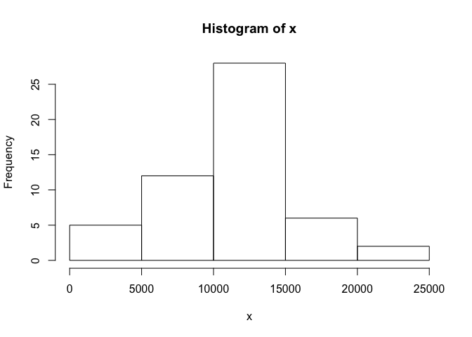
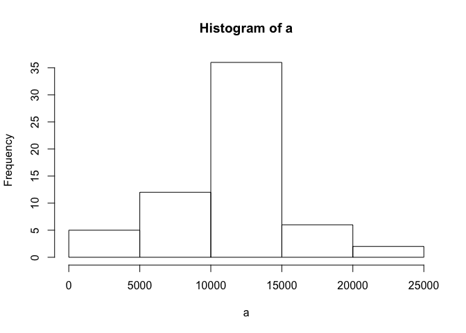
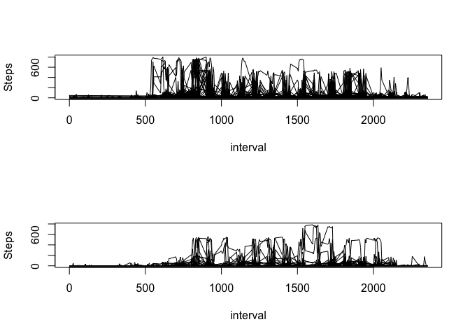

# Reproducible Research: Peer Assessment 1


## Loading and preprocessing the data

```r
library(dplyr)
```

```
## 
## Attaching package: 'dplyr'
```

```
## The following objects are masked from 'package:stats':
## 
##     filter, lag
```

```
## The following objects are masked from 'package:base':
## 
##     intersect, setdiff, setequal, union
```

```r
activity <- read.csv("activity.csv")

activity$date <- as.Date(activity$date)

activityNaOmit <- na.omit(activity)
```

## What is mean total number of steps taken per day?

```r
x <- tapply(activityNaOmit$steps, activityNaOmit$date, sum)

hist(x)
```

<!-- -->

```r
mean(x)
```

```
## [1] 10766.19
```

```r
median(x)
```

```
## [1] 10765
```
## What is the average daily activity pattern?

```r
y <- tapply(activityNaOmit$steps, activityNaOmit$interval, mean)
z <- activityNaOmit[,3]
stepsOverAverageDay <- data.frame(z[1:length(y)])
stepsOverAverageDay <- cbind(stepsOverAverageDay, y)
names(stepsOverAverageDay) <- c("interval", "steps")
dimnames(stepsOverAverageDay)[[1]] <- c(1:length(y))
plot(stepsOverAverageDay, type="l")
```

<!-- -->

```r
stepsOverAverageDay[which(stepsOverAverageDay$steps == max(stepsOverAverageDay$steps)), ]
```

```
##     interval    steps
## 104      835 206.1698
```

## Imputing missing values


```r
sum(is.na(activity$steps))
```

```
## [1] 2304
```

# My strategy for imputing the missing values was to use the mean value for the time interval, since using the mean for the particular day did not work for days with no observations

```r
activityImputeNA <- activity
for (i in 1:length(activityImputeNA$steps)) {
    if (is.na(activityImputeNA$steps[i])){
        blankStep <- activityImputeNA$interval[i]
        activityImputeNA$steps[i] <- as.numeric(stepsOverAverageDay$steps[which(stepsOverAverageDay$interval == blankStep)])
    }
}
a <- tapply(activityImputeNA$steps, activityImputeNA$date, sum)
```
Here we se a differnce in the two data sets

```r
hist(a)
```

<!-- -->

```r
mean(a)
```

```
## [1] 10766.19
```

And here as well

```r
median(a)
```

```
## [1] 10766.19
```
## Are there differences in activity patterns between weekdays and weekends?

```r
activityImputeNA$weekday <- ifelse(weekdays(activityImputeNA$date) == "Saturday" | weekdays(activityImputeNA$date) == "Sunday", "weekend", "weekday")

activityImputeNAWeekday <- filter(activityImputeNA, activityImputeNA$weekday == "weekday")
activityImputeNAWeekend <- filter(activityImputeNA, activityImputeNA$weekday == "weekend")

par(mfrow = c(2,1))
plot(activityImputeNAWeekday$interval, activityImputeNAWeekday$steps, xlab = "interval", ylab = "Steps", type = "l")
plot(activityImputeNAWeekend$interval, activityImputeNAWeekend$steps, xlab = "interval", ylab = "Steps", type = "l")
```

<!-- -->
